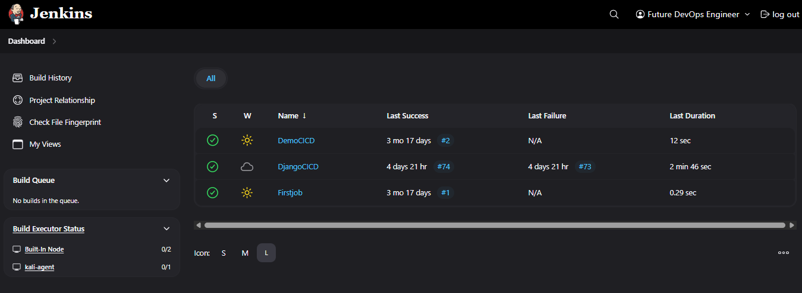

# Jenkins RBAC Guide

# 🔐 Jenkins RBAC (Role-Based Access Control) Guide

This repository provides a comprehensive guide on how to configure and use **Role-Based Access Control (RBAC)** in Jenkins using the **Role Strategy Plugin**. Ideal for DevOps engineers and teams who want to manage user permissions securely and efficiently in CI/CD pipelines.

---

## 📌 What is RBAC?

**Role-Based Access Control (RBAC)** is a method of restricting access to Jenkins features based on a user’s role. This ensures secure and well-managed CI/CD environments, especially in production-grade Jenkins setups.

---

## 🚀 Features

- Granular permission settings
- Role creation (admin, viewer, developer, etc.)
- Secure job, node, and build access
- Easy GUI-based configuration
- Scalable for teams and enterprises

---

## 🔧 How to Set Up RBAC in Jenkins

### 1️⃣ Install the Role Strategy Plugin

- Navigate to `Manage Jenkins` > `Manage Plugins`
- Search for **"Role Strategy Plugin"** under the Available tab
- Install and restart Jenkins

### 2️⃣ Define Roles

- Go to `Manage Jenkins` → `Manage and Assign Roles` → `Manage Roles`
- Create roles like `admin`, `viewer`, `developer`, etc.
- Assign specific permissions per category:
  - Overall
  - Credentials
  - Agent
  - Job
  - Run
  - View
  - SCM
  - Metrics

🖼️ Example:

### 3️⃣ Assign Users to Roles

- Go to `Assign Roles`
- Add users and assign them to one or more roles

---

## 🔐 Role Examples

| Role   | Permission Summary                      |
|--------|------------------------------------------|
| admin  | Full access to all Jenkins resources     |
| viewer | Read-only access to all views and jobs   |

---

## 💡 Best Practices

- ✅ Assign minimal privileges for daily users
- ✅ Use `admin` only for actual administrators
- ✅ Integrate with LDAP/GitHub SSO for team-based access
- ✅ Regularly audit user-role mappings
- ✅ Backup Jenkins configs regularly

---

## 🖥️ Demo Dashboard

Here’s a sample Jenkins job dashboard with RBAC in action:

---

## 📄 More Documentation

- [`roles-config.md`](roles-config.md): Detailed permission matrix and example configurations

---

## 📜 License

This project is licensed under the [MIT License](LICENSE).

---

## 🤝 Contributing

Contributions are welcome! Feel free to open an issue or pull request if you'd like to add enhancements, clarify instructions, or share use cases.

---

## 📬 Contact

Feel free to reach out via [LinkedIn]((https://www.linkedin.com/in/muhammad-tayyab06/)) or [email](mailto:tayyab.shafique06@gmail.com) for feedback or questions.

---

## 📢 Shoutout

If this helped you, consider giving this repo a ⭐ and sharing with your DevOps network!

